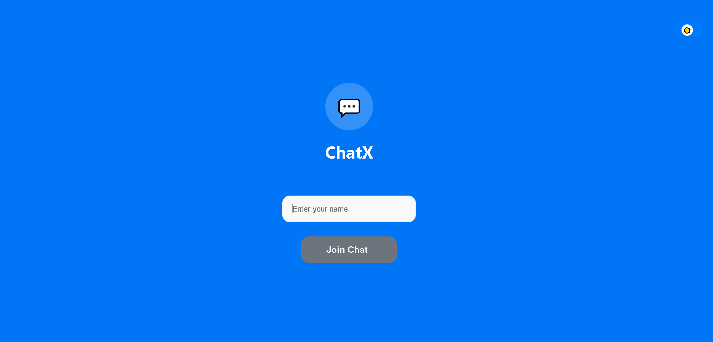
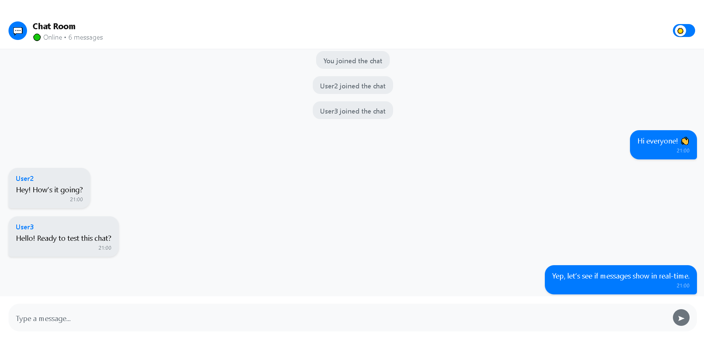
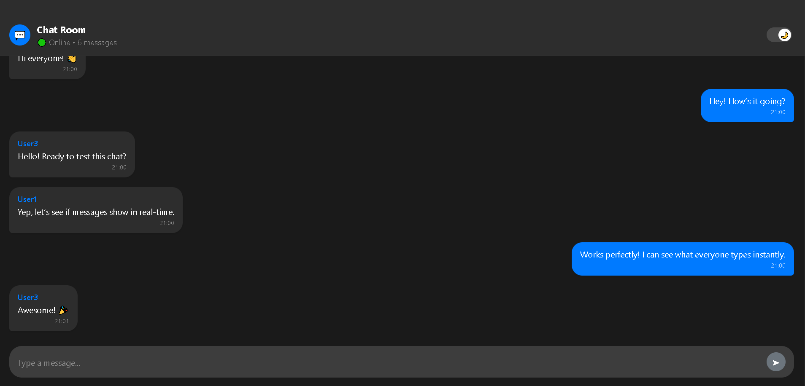

# 💬 Real-Time Chat Room App (*ChatX*)

A simple **real-time chat room** application built using **WebSockets** (`ws`) in Node.js with an HTML CSS JS frontend.  

---

## ✨ Features

- **Real-time Messaging** – Messages are instantly broadcasted to all connected users.  
- **Multi-user Support** – Multiple clients can join the chat room simultaneously.  
- **Simple UI** – Minimal HTML CSS JS interface for easy chat interactions.  
- **Single-folder Project** – Backend and frontend together for easy setup.

---

## 🛠️ Tech Stack

- **Backend:** Node.js with `ws` WebSocket library  
- **Frontend:** HTML, CSS, JavaScript  
- **Communication:** WebSocket protocol for real-time messaging  

---

## 📂 Project Structure
```
.
├── 📄 index.html     # Frontend HTML page
├── 📄 server.js      # Node.js WebSocket server
├── 📂 screenshots    # Screenshots folder
├── 📄 README.md      # Project documentation
└── ...
```

---

## 🚀 Getting Started

### 1️⃣ Install Dependencies

Make sure you have Node.js installed, then run:

```bash
npm install
```

### 2️⃣ Run the Server
```bash
npm start
```
#### The WebSocket server runs on ws://localhost:8080.

### 3️⃣ Open the Chat
#### Open *index.html* in your browser.
#### Open multiple tabs to test real-time communication between users.

---

## 📸 Screenshots




## 💡 Notes
- This is a basic chat app without authentication.
- You can extend it by adding private messaging, or persistent chat history.

---

## 📜 License
### This project is licensed under the MIT License. Free to use and modify.

---

## ✨ Author
### Mohamed Rida Elaaich
#### Full-stack developer passionate about secure web applications.
